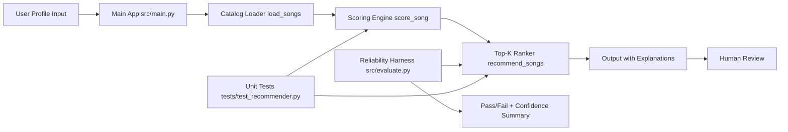

# Applied AI System Final: Explainable Music Recommender

## Title and Summary

This project is an applied AI recommendation system that ranks songs for a user profile and explains why each recommendation was selected. It combines transparent scoring logic, guardrails for invalid inputs, and a reliability harness to measure consistency across predefined test scenarios.

The goal is to demonstrate trustworthy AI behavior: clear decision logic, reproducible results, and explicit evaluation.

## Original Project (Modules 1-3) and Extension

**Original project:** Module 3 Music Recommender Simulation.

The original version implemented a content-based recommendation prototype that scored songs using genre, mood, and energy alignment. It could load a CSV catalog, rank songs, and print top results.

This final project extends that prototype into a complete applied AI system by adding:
- richer scoring features (tempo, valence, danceability, acousticness),
- recommendation explanations for every score,
- guardrails for out-of-range user inputs,
- a reliability/evaluation harness with pass/fail checks and confidence summaries,
- documentation and model card content aimed at professional portfolio review.

## AI Feature Requirement Satisfied

This system uses the **Reliability or Testing System** feature as a fully integrated part of application behavior:
- unit tests validate core recommender behavior,
- a dedicated evaluation script runs end-to-end scenarios,
- confidence scores are computed from recommendation scores,
- guardrails clamp invalid numeric preferences so the system fails safely.

## Architecture Overview

Main components:
- `src/main.py`: CLI demo runner for user profiles and top-k outputs.
- `src/recommender.py`: core AI scoring and ranking logic.
- `src/evaluate.py`: reliability harness (predefined checks + summary metrics).
- `tests/test_recommender.py`: automated tests for sorting and explanation behavior.
- `data/songs.csv`: local catalog used by the recommender.

Data flow:



Mermaid source is stored in `assets/system_architecture.mmd`.

## Project Structure

```text
applied-ai-system-final/
  assets/
    system_architecture.mmd
  data/
    songs.csv
  src/
    main.py
    recommender.py
    evaluate.py
  tests/
    test_recommender.py
  README.md
  model_card.md
  reflection.md
  requirements.txt
```

## Setup Instructions

### 1. Clone and enter project

```bash
git clone <your-repo-url>
cd applied-ai-system-final
```

### 2. Create a virtual environment (recommended)

```bash
python -m venv .venv
```

Activate:

```bash
# Windows
.venv\Scripts\activate

# macOS/Linux
source .venv/bin/activate
```

### 3. Install dependencies

```bash
pip install -r requirements.txt
```

### 4. Run the recommender demo

```bash
python -m src.main
```

### 5. Run automated tests

```bash
python -m pytest -q
```

### 6. Run reliability harness

```bash
python -m src.evaluate
```

### 7. Run everything in one command

```bash
python scripts/run_all.py
```

This command runs:
- demo output (`src.main`),
- unit tests,
- reliability harness.

## Sample Interactions (End-to-End)

### Example 1: High-Energy Pop

Input profile:

```python
{
  "genre": "pop",
  "mood": "happy",
  "energy": 0.85,
  "tempo_bpm": 125,
  "valence": 0.8,
  "danceability": 0.82,
  "likes_acoustic": False
}
```

Output excerpt:

```text
1. Sunrise City by Neon Echo | score=6.49
   reasons: genre match (+2.0); mood match (+1.2); energy closeness (+1.46); ...
2. Gym Hero by Max Pulse | score=5.27
3. Rooftop Lights by Indigo Parade | score=4.38
```

### Example 2: Chill Lofi

Input profile:

```python
{
  "genre": "lofi",
  "mood": "chill",
  "energy": 0.35,
  "tempo_bpm": 78,
  "valence": 0.58,
  "danceability": 0.58,
  "likes_acoustic": True
}
```

Output excerpt:

```text
1. Library Rain by Paper Lanterns | score=6.58
2. Midnight Coding by LoRoom | score=6.42
3. Focus Flow by LoRoom | score=5.29
```

### Example 3: Deep Intense Rock

Input profile:

```python
{
  "genre": "rock",
  "mood": "intense",
  "energy": 0.92,
  "tempo_bpm": 148,
  "valence": 0.45,
  "danceability": 0.62,
  "likes_acoustic": False
}
```

Output excerpt:

```text
1. Storm Runner by Voltline | score=6.58
2. Gym Hero by Max Pulse | score=4.30
3. Iron Pulse by Granite Sky | score=3.22
```

## Reliability and Evaluation Summary

What was tested:
- unit tests for ranking order and explanation output,
- predefined scenario checks in `src/evaluate.py`,
- guardrail behavior with out-of-range numeric inputs.

Current observed results:
- Unit tests: **2/2 passed** using `python -m pytest -q`.
- Reliability harness: **4/4 checks passed**.
- Average confidence across reliability checks: approximately **0.93**.

What worked well:
- direct genre/mood matches consistently surfaced expected songs,
- explanation strings made each recommendation auditable,
- clamping prevented invalid inputs from crashing or producing nonsensical scores.

What did not work as well:
- ranking is sensitive to weight choices,
- tiny dataset limits generalization and diversity.

## Logging, Guardrails, and Error Handling

Implemented safeguards:
- numeric preference clamping for normalized features to `[0,1]`,
- non-negative tempo handling,
- deterministic top-k behavior with safe return on invalid `k` values (`k <= 0` returns empty list).

## Design Decisions and Trade-offs

1. **Chose transparent weighted scoring over opaque model behavior**
   - Pro: easy to explain and debug.
   - Con: less adaptive than learned ranking models.

2. **Kept local CSV data source**
   - Pro: reproducible and simple to run.
   - Con: limited realism and catalog diversity.

3. **Added confidence from score normalization**
   - Pro: gives evaluators a quick reliability signal.
   - Con: confidence reflects model internals, not external ground truth.

## Reflection

This project reinforced that trustworthy AI is as much about evaluation and communication as it is about model logic. Small scoring changes produced large ranking shifts, which highlighted the need for explicit tests and clear documentation.

I also learned that transparent systems are easier to improve responsibly: when the model explains each decision component, failures become diagnosable rather than mysterious.

## Demo Walkthrough

Loom is not provided for this submission. A reproducible walkthrough is included here:

- Walkthrough artifact: [assets/demo_walkthrough.md](assets/demo_walkthrough.md)

It includes:
- end-to-end run with 3 input profiles,
- AI feature behavior (reliability + confidence output),
- guardrail evaluation case,
- clear command/output evidence for each case.

## Portfolio Artifact

What this project says about me as an AI engineer:

I design AI systems that prioritize reliability, clear reasoning, and responsible documentation. I can turn an early prototype into a structured artifact with reproducible setup, evaluation evidence, and transparent model behavior suitable for stakeholder review.

## Submission Checklist

- [ ] Public GitHub repo with final code.
- [ ] Multiple meaningful commits.
- [x] Functional code and tests.
- [x] Comprehensive `README.md`.
- [x] `model_card.md` with reflection prompts.
- [x] System architecture diagram (Mermaid in README + source in assets).
- [x] Organized assets folder (`assets/`).
- [ ] Loom walkthrough link added.
- [ ] Final push completed before deadline.
